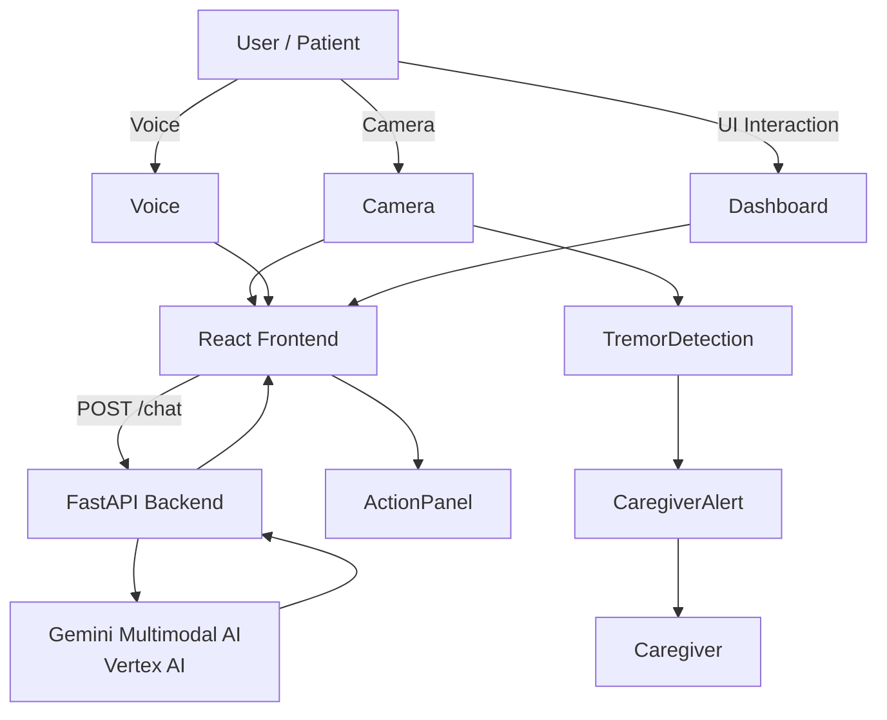

# 🧠 NeuroGuardian AI Agent

AI-powered cognitive assistant designed to support individuals living with **Alzheimer’s, dementia, Parkinson’s tremor, and other neurological conditions**.

NeuroGuardian uses **multimodal AI (vision + voice + environment analysis)** to monitor the user's surroundings, provide reminders, detect unusual motion patterns, and assist with daily activities.

---

# 🚩 Problem

Over **55 million people worldwide live with dementia**, and many struggle with:

* remembering medication schedules
* recognizing daily tasks
* interacting with digital interfaces
* unnoticed tremors or unusual behavior
* lack of immediate caregiver support

Existing tools focus on **static reminders**, but they rarely understand the **user’s environment or behavior in real time**.

---

# 💡 Solution

NeuroGuardian acts as a **real-time AI companion** that observes the user’s environment, understands context, and provides assistance.

The system combines:

* **Camera-based environment awareness**
* **Voice interaction**
* **AI reasoning using Gemini**
* **Motion pattern detection**
* **Caregiver alerting**

---

# ✨ Key Features

## 📷 Environment Awareness

NeuroGuardian continuously analyzes camera input to understand the user’s surroundings.

Example:

```
Medication bottle detected on table
→ Suggest taking medication
```

---

## 🗣 Voice Assistant

Users can interact naturally:

```
User: What should I do next?
NeuroGuardian: Your next medication is scheduled at 7 PM.
```

Speech recognition runs in the browser and sends transcripts to the AI backend.

---

## 💊 Medication Reminder Dashboard

The system can interpret a care dashboard UI and suggest actions.

Example dashboard:

```
Next Medication: 7:00 PM
Take Medication
Call Caregiver
Log Activity
```

AI response:

```json
{
 "analysis": "The dashboard shows medication scheduled at 7 PM.",
 "actions": {
   "action": "remind",
   "target": "Take Medication button"
 }
}
```

---

## ⚠ Tremor Detection

NeuroGuardian compares consecutive camera frames to detect **repetitive motion patterns** that may resemble tremor.

Example alert:

```
⚠ Possible tremor detected
Caregiver notified
```

---

## 👨‍⚕️ Caregiver Alert Simulation

If unusual behavior is detected, the system can trigger alerts.

Example API call:

```
POST /caregiver-alert
```

---

# 🏗 System Architecture



---

# ⚙ Tech Stack

### Frontend

* React
* Web Speech API
* HTML5 Camera API
* html2canvas

### Backend

* Python
* FastAPI
* REST API

### AI

* Google Vertex AI
* Gemini 2.5 Flash
* Multimodal reasoning

---

# 🔄 Data Flow

### Environment Monitoring

```
Camera Frame
     ↓
React VideoInput
     ↓
POST /chat
     ↓
Gemini Vision Analysis
     ↓
AI Guidance Panel
```

---

### Voice Interaction

```
Speech Input
     ↓
Browser SpeechRecognition
     ↓
Transcript
     ↓
POST /chat
     ↓
Gemini Reasoning
     ↓
Response displayed in UI
```

---

### Tremor Detection

```
Video Frame
     ↓
Frame Comparison
     ↓
Motion Threshold Exceeded
     ↓
Caregiver Alert
```

---

# 📂 Project Structure

```
neuroguardian-ai-agent/
│
├── frontend/
│   ├── src/
│   │   ├── App.jsx
│   │   ├── components/
│   │   │   ├── VideoInput.jsx
│   │   │   ├── ScreenCapture.jsx
│   │   │   ├── VoiceChat.jsx
│   │   │   └── CaregiverAlert.jsx
│   │   └── services/
│   │       └── apiClient.js
│
├── backend/
│   ├── main.py
│   ├── routes/
│   │   ├── agent_routes.py
│   │   └── alert_routes.py
│   └── services/
│       └── gemini_live_service.py
│
└── README.md
```

---

# 🚀 Running the Project

### Backend

```bash
uv run uvicorn backend.main:app --reload
```

Backend runs at:

```
http://127.0.0.1:8000
```

---

### Frontend

```bash
cd frontend
npm install
npm run dev
```

Open:

```
http://localhost:5173
```

---

# 🎬 Demo Scenario

Example demo flow:

1️⃣ Camera observes medication bottle
2️⃣ AI recognizes medication context
3️⃣ Dashboard screenshot analyzed
4️⃣ Voice command issued
5️⃣ Tremor detection triggered

Result:

```
AI Insight
Medication reminder detected

Suggested Assistance
Take medication now
```

---

# 📈 Future Improvements

Planned enhancements:

* real-time Gemini Live monitoring
* voice responses from the AI assistant
* Firestore-based patient memory timeline
* caregiver mobile dashboard
* mobile app deployment

---

# 🌍 Vision

NeuroGuardian aims to evolve into a **real-time cognitive companion** that helps patients maintain independence while supporting caregivers with intelligent insights.

---

# 👥 Contributors

Built with ❤️ for assistive healthcare innovation.

---

# 📜 License

MIT License

---

# ⭐ Support the Project

If you like this project, consider giving it a ⭐ on GitHub.


