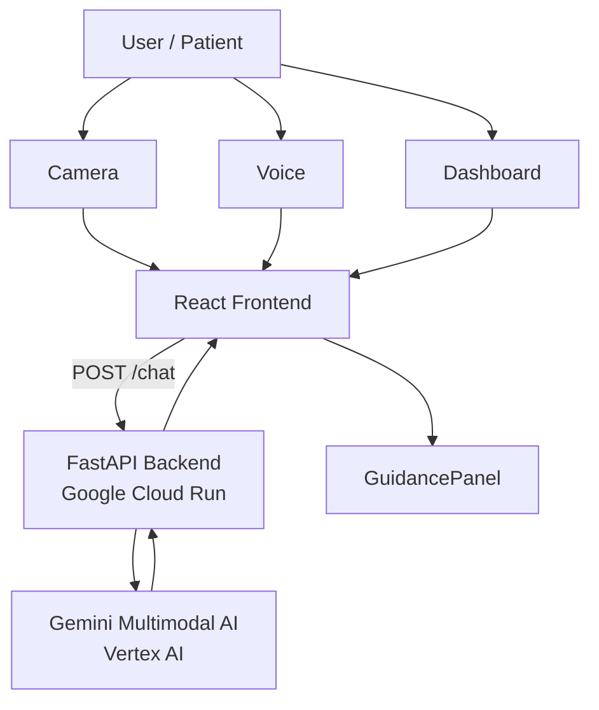

# 🧠 NeuroGuardian AI Agent

AI-powered **cognitive assistance companion** designed to support **elderly users and individuals experiencing memory loss, confusion, stress, or neurological conditions**.

NeuroGuardian combines **computer vision, voice interaction, and multimodal AI reasoning** to observe surroundings, understand context, and assist users in real time.

---

# 🌐 Live Demo

### Frontend (Firebase Hosting)

```
https://armour-assistant.web.app
```

### Backend API (Google Cloud Run)

```
https://neuroguardian-backend-1024847090973.us-central1.run.app
```

---

# 🚩 Problem

Over **55 million people worldwide live with dementia or cognitive decline**, and millions more experience:

- memory lapses  
- medication confusion  
- emotional distress  
- tremors  
- difficulty navigating digital tools  
- lack of immediate caregiver support  

Most digital tools rely on **static reminders**, but they do not understand a user's **environment or behavior in real time**.

---

# 💡 Solution

NeuroGuardian acts as a **real-time AI companion** that observes the user's environment, understands context, and offers assistance.

The system integrates:

- 📷 camera-based environmental awareness  
- 🗣 voice interaction  
- 🤖 Gemini multimodal reasoning  
- 📊 behavior monitoring  
- 👨‍⚕️ caregiver assistance simulation  

---

# ✨ Key Features

## 📷 AI Vision Monitoring

The system captures frames from the user’s environment and performs **multimodal analysis using Gemini**.

Example insight:

```
Glasses detected on nearby table
→ Suggest user check table
```

The vision pipeline uses **temporal observation windows** to analyze frames over time instead of individual snapshots.

---

## 🗣 Voice Interaction

Users can speak naturally to NeuroGuardian.

Example:

```
User: Where are my glasses?
NeuroGuardian: Your glasses were last seen near the bedside table.
```

Voice processing uses:

- Browser **SpeechRecognition API**
- Gemini reasoning
- Spoken responses via **SpeechSynthesis**

---

## 🧠 Context Awareness

The AI evaluates:

- confusion behavior  
- searching patterns  
- emotional distress  
- environmental cues  

Example AI output:

```json
{
 "analysis": "User appears to be searching for glasses.",
 "actions": {
   "action": "assist_search",
   "target": "glasses"
 },
 "response": "Your glasses were last seen near the bedside table."
}
```

---

## ⚠ Motion / Tremor Detection

NeuroGuardian compares consecutive frames to detect unusual movement patterns.

Example alert:

```
⚠ Possible tremor detected
Caregiver alert suggested
```

---

## 🧾 Dashboard Understanding

The AI can analyze **UI screenshots** to understand medication reminders or care dashboards.

Example:

```
Next Medication: 7 PM
→ AI recommends medication reminder
```

---

# 🏗 System Architecture



---

# ☁ Cloud Infrastructure

The application runs entirely on **Google Cloud serverless infrastructure**.

| Component | Service |
|--------|--------|
| Frontend Hosting | Firebase Hosting |
| Backend API | Google Cloud Run |
| AI Models | Vertex AI Gemini |
| Container Registry | Artifact Registry |
| CI/CD Builds | Cloud Build |
| Logging | Cloud Logging |

---

# ⚙ Tech Stack

## Frontend

- React  
- Vite  
- Web Speech API  
- HTML5 Camera API  
- html2canvas  

---

## Backend

- Python  
- FastAPI  
- REST API  

---

## AI

- Google Vertex AI  
- Gemini 2.5 Flash  
- Multimodal reasoning  

---

## Cloud

- Google Cloud Run  
- Firebase Hosting  
- Artifact Registry  
- Cloud Build  

---

# 🔄 Data Flow

### AI Vision Pipeline

```
Camera frames
     ↓
VideoInput (React)
     ↓
Frame buffer (10s observation window)
     ↓
POST /chat
     ↓
Gemini vision reasoning
     ↓
AI Guidance Panel
```

---

### Voice Interaction

```
Speech Input
     ↓
Browser SpeechRecognition
     ↓
Transcript
     ↓
POST /chat
     ↓
Gemini reasoning
     ↓
Voice response
```

---

### Memory Assistance

```
Object detected
     ↓
Stored in memory
     ↓
User asks:
"Where are my glasses?"
     ↓
Memory lookup
     ↓
AI response
```

---

# 📂 Project Structure

```
neuroguardian-ai-agent
│
├── frontend
│   ├── src
│   │   ├── App.jsx
│   │   ├── components
│   │   │   ├── VideoInput.jsx
│   │   │   ├── ScreenCapture.jsx
│   │   │   ├── VoiceChat.jsx
│   │   │   └── CaregiverAlert.jsx
│   │   └── services
│   │       └── apiClient.js
│
├── backend
│   ├── main.py
│   ├── routes
│   │   ├── agent_routes.py
│   │   └── alert_routes.py
│   └── services
│       ├── gemini_live_service.py
│       ├── emotion_service.py
│       └── memory_agent.py
│
├── deployment
│   └── backend
│       └── cloudbuild.yaml
│
└── README.md
```

---

# 🚀 Running Locally

## Backend

```bash
uvicorn backend.main:app --reload
```

Backend runs at:

```
http://localhost:8000
```

---

## Frontend

```bash
cd frontend
npm install
npm run dev
```

Open:

```
http://localhost:5173
```

---

# ☁ Deployment

### Backend Deployment

```bash
gcloud builds submit --config deployment/backend/cloudbuild.yaml
```

```bash
gcloud run deploy neuroguardian-backend
```

---

### Frontend Deployment

```bash
npm run build
firebase deploy
```

---

# 🎬 Example Demo Flow

1️⃣ AI observes environment  
2️⃣ Frames analyzed by Gemini  
3️⃣ User asks question via voice  
4️⃣ AI suggests action  

Result:

```
AI Insight
User appears to be searching for glasses

Suggested Assistance
Check bedside table
```

---
# 🧪 Reproducible Testing & Quick Verification

This project can be reproduced and verified using the following steps.  
These instructions allow reviewers, developers, or researchers to quickly validate the functionality of NeuroGuardian.

---

## 1️⃣ Test the Live Deployment

The deployed demo can be accessed here:

Frontend:
https://armour-assistant.web.app
Backend API:
https://neuroguardian-backend-1024847090973.us-central1.run.app

Example API test:

```bash
curl -X POST https://neuroguardian-backend-1024847090973.us-central1.run.app/chat \
-H "Content-Type: application/json" \
-d '{"prompt": "I cannot find my glasses"}'

2️⃣ Run the System Locally

Clone the repository:
git clone https://github.com/your-repo/neuroguardian-ai-agent.git
cd neuroguardian-ai-agent

Start Backend
uvicorn backend.main:app --reload

Backend will run at:

http://localhost:8000

Interactive API documentation:

http://localhost:8000/docs

☁ Deployment
Backend Deployment
gcloud builds submit --config deployment/backend/cloudbuild.yaml
gcloud run deploy neuroguardian-backend
Frontend Deployment
npm run build
firebase deploy


🎬 Example Demo Flow

1️⃣ AI observes environment
2️⃣ Frames analyzed by Gemini
3️⃣ User asks question via voice
4️⃣ AI suggests action

Result:

AI Insight
User appears to be searching for glasses

Suggested Assistance
Check bedside table
📈 Future Improvements

Planned upgrades:

real-time Gemini live video analysis

multi-frame behavioral detection

caregiver dashboard

Firestore patient memory timeline

mobile deployment

🌍 Vision

NeuroGuardian aims to become a real-time cognitive companion that helps individuals maintain independence while assisting caregivers with intelligent insights.

👥 Contributors

Built with ❤️ for assistive healthcare innovation.

📜 License

MIT License

⭐ Support the Project

If you like this project, please consider giving it a ⭐ on GitHub.


---

If you'd like, I can also help you add **two sections that significantly improve AI project READMEs for GitHub and research visibility**:

- **📊 Evaluation & Benchmarking**
- **🔐 Privacy & Safety for Healthcare AI**

These are often expected in **AI + healthcare projects**.

# 📈 Future Improvements

Planned upgrades:

- real-time Gemini live video analysis  
- multi-frame behavioral detection  
- caregiver dashboard  
- Firestore patient memory timeline  
- mobile deployment  

---

# 🌍 Vision

NeuroGuardian aims to become a **real-time cognitive companion** that helps individuals maintain independence while assisting caregivers with intelligent insights.

---

# 👥 Contributors

Built with ❤️ for assistive healthcare innovation.

---

# 📜 License

MIT License

---

# ⭐ Support the Project

If you like this project, please consider giving it a ⭐ on GitHub.
